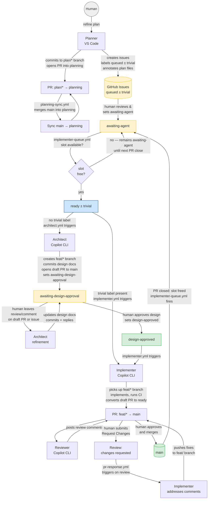

# Agent Instructions

## Before every commit

Run the full local CI gate and confirm it passes:

```bash
cargo make ci
```

This runs, in order: `check` → `fmt` → `lint` → `test` → `coverage` → `audit`.

Do **not** commit if any step fails. Fix the failure first, then re-run `cargo make ci` in full before committing.

## Development workflow



The Architect is **required for all non-trivial issues**. The Planner classifies each issue at creation time — trivial issues receive a `trivial` label alongside `queued` and bypass the Architect stage entirely.

Each stage has a dedicated agent mode (`.github/agents/`):

| Stage | Agent | What it does |
|---|---|---|
| Plan + Backlog | `Planner` | Works with the human through Q&A to define and refine the plan; writes plan files; creates GitHub issues labelled `queued` (± `trivial`); annotates plan files with issue numbers; commits to a `plan/*` session branch; opens PR into `planning` |
| Schedule | Workflow | `implementer-queue.yml` — fires on `awaiting-agent` label and on `feat/*` PR close; promotes the oldest `awaiting-agent` issue to `ready` when the slot count is below the limit |
| Design | `Architect` | Triggered by `ready` on non-trivial issues; creates `feat/<issue-number>-<slug>` branch from `main`, commits design docs (`docs/design/`, `docs/adr/` if needed), opens a draft PR to `main`, posts a design summary on the issue, sets `awaiting-design-approval` |
| Design refinement | `Architect` | Re-triggered by `architect-response.yml` (PR reviews) or `architect-comment-receive.yml`/`architect-comment-run.yml` (issue comments) while `awaiting-design-approval`; updates design docs, commits, posts a reply — repeats until human sets `design-approved` |
| Implement | `Implementer` | Triggered by `ready` (trivial) or `design-approved` (non-trivial); picks up the existing `feat/*` branch (or creates it for trivial), implements, runs CI, converts draft PR to ready |
| Review | `Reviewer` | Reads the PR diff, checks against instructions and ADRs, posts comments — never touches code |
| Approve | **Human** | Final approval and merge; agents never merge |

**Role boundaries are strict.** Only the Planner edits the build plan and creates GitHub issues. Only the Scheduler sets the `ready` label. Only humans approve and merge PRs.

## Issue label pipeline

Issues move through a fixed sequence of labels. No agent or automation skips or reverses a state.

| Label | Set by | Meaning |
|---|---|---|
| `queued` | Planner | Issue created; not yet human-reviewed |
| `trivial` | Planner | Co-applied with `queued`; issue bypasses the Architect stage |
| `awaiting-agent` | Human | Reviewed and approved for implementation; waiting for a concurrency slot |
| `ready` | Scheduler | Slot granted; triggers Architect (non-trivial) or Implementer (trivial) |
| `awaiting-design-approval` | Architect | Design posted to the issue; waiting for human sign-off |
| `design-approved` | Human | Design approved; triggers Implementer |

### Concurrency limit

`implementer-queue.yml` enforces a cap on the number of concurrently in-flight issues. The limit is stored as the `IMPLEMENTER_CONCURRENCY_LIMIT` GitHub Actions repository variable (default: `1`).

A slot is **in use** when an open issue holds any of the labels `ready`, `awaiting-design-approval`, or `design-approved`, or has an associated open `feat/*` PR. The scheduler counts all such slots before promoting the next `awaiting-agent` issue.

When a `feat/*` PR is closed (merged or abandoned) the workflow re-evaluates the slot count and promotes the oldest `awaiting-agent` issue if a slot has freed up.

`pr-response.yml` (addressing review comments on an already-open PR) is exempt from the slot limit — it never opens a new PR.

## Branch structure

| Branch | Purpose |
|---|---|
| `main` | Stable, releasable code. Feature code, design docs, and ADRs all land here via `feat/*` PRs. |
| `planning` | Long-lived. Holds only `docs/plans/` files. Never merged to `main` on a schedule — only at deliberate phase checkpoints. Regularly synced FROM `main` via an automated workflow. |
| `plan/<description>` | Short-lived session branches created from `planning`. Planner works here. Merged into `planning` via PR. Deleted after merge. |
| `feat/<issue-number>-<slug>` | Short-lived implementation branches created from `main`. Architect seeds with design docs; Implementer adds the code. Merged into `main` via PR. |

## Keeping `planning` in sync with `main`

`.github/workflows/planning-sync.yml` runs on every PR opened against `planning` and merges `main` in automatically. This keeps the plan files up to date with the latest codebase state so the Planner always works with current context.

## Finding the current phase

The build plan is split by phase under `docs/plans/`. The index lives at `docs/plans/main.md` — read it first to see the phase list and current status, then open the relevant phase file (e.g. `docs/plans/phase-02-macro-system.md`) to find the current incomplete section. Always identify the current phase before planning or implementing anything.

## Architectural decisions

Core design decisions are recorded in `docs/adr/`. Read the relevant ADR(s) before implementing any feature — these record *why* things are the way they are and constrain the acceptable solution space.

**ADRs are immutable.** Once accepted, the body of an ADR is never edited. If a decision changes, create a new ADR that supersedes the old one, update the old ADR's status field to `Superseded by ADR-XXXX`, and link forward to the new record.

## Instruction files

| Path | Scope |
|---|---|
| `.github/instructions/lang/rust.instructions.md` | All `.rs` files |
| `.github/instructions/modules/vertexrs.instructions.md` | `vertexrs/src/**/*.rs` |
| `.github/instructions/modules/vertexrs-macro.instructions.md` | `vertexrs-macro/src/**/*.rs` |
| `.github/instructions/process/planning.instructions.md` | Creating issues |
| `.github/instructions/process/testing.instructions.md` | Writing/reviewing tests |
| `.github/instructions/process/benchmarking.instructions.md` | Writing/reviewing benchmarks |
| `.github/instructions/process/security.instructions.md` | Security-sensitive code |
| `.github/instructions/process/pr-review.instructions.md` | Reviewing PRs |
