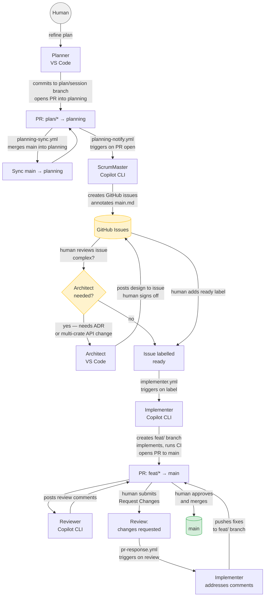

# Agent Instructions

## Development workflow



The Architect step is **conditional** — only required when an issue needs a new ADR or touches more than one crate's public API. Simple issues skip it.

Each stage has a dedicated agent mode (`.github/agents/`):

| Stage | Agent | What it does |
|---|---|---|
| Plan | `Planner` | Collaborative thinking partner — works with the human through Q&A to define and refine `main.md`; commits to a `plan/*` session branch; opens PR into `planning` |
| Backlog | `ScrumMaster` | Invoked on a `plan/*` → `planning` PR; reads the diff, creates GitHub issues, annotates `main.md` on `planning` with issue numbers |
| Design *(conditional)* | `Architect` | Produces a technical design and/or ADR draft for complex issues; posts to the issue for human sign-off before implementation starts |
| Implement | `Implementer` | Picks up one issue, asks clarifying questions, writes code, runs CI, opens a PR to `main` |
| Review | `Reviewer` | Reads the PR diff, checks against instructions and ADRs, posts comments — never touches code |
| Approve | **Human** | Final approval and merge; agents never merge |

**Role boundaries are strict.** Only the Planner edits the build plan. Only the ScrumMaster creates GitHub issues. Only humans approve and merge PRs.

## Branch structure

| Branch | Purpose |
|---|---|
| `main` | Stable, releasable code. Plan checkpoints merged here infrequently and deliberately. |
| `planning` | Long-lived. Holds the evolving `docs/plans/main.md`. Never merged to `main` on a schedule — only at deliberate phase checkpoints. Regularly synced FROM `main` via an automated workflow (see below). |
| `plan/<description>` | Short-lived session branches created from `planning`. Planner works here. Merged into `planning` via PR. Deleted after merge. |
| `feature/<description>` | Short-lived implementation branches created from `main`. Implementer works here. Merged into `main` via PR. |

## Keeping `planning` in sync with `main`

`.github/workflows/planning-sync.yml` runs on every PR opened against `planning` and merges `main` in automatically. If the merge is clean it pushes directly; if there is a conflict Copilot attempts to resolve it first, and only opens a manual-resolution PR if it cannot. This ensures the plan is always up to date with main before the ScrumMaster processes a new session diff.

## Finding the current phase

The active build plan lives in `docs/plans/main.md`. Always read this first to find the current phase (most recent incomplete section) before planning or implementing anything.

## Architectural decisions

Core design decisions are recorded in `docs/adr/`. Read the relevant ADR(s) before implementing any feature — these record *why* things are the way they are and constrain the acceptable solution space.

**ADRs are immutable.** Once accepted, the body of an ADR is never edited. If a decision changes, create a new ADR that supersedes the old one, update the old ADR's status field to `Superseded by ADR-XXXX`, and link forward to the new record.

## Instruction files

| Path | Scope |
|---|---|
| `.github/instructions/lang/rust.instructions.md` | All `.rs` files |
| `.github/instructions/modules/vertexrs.instructions.md` | `vertexrs/src/**/*.rs` |
| `.github/instructions/modules/vertexrs-macro.instructions.md` | `vertexrs-macro/src/**/*.rs` |
| `.github/instructions/process/planning.instructions.md` | Creating issues |
| `.github/instructions/process/testing.instructions.md` | Writing/reviewing tests |
| `.github/instructions/process/benchmarking.instructions.md` | Writing/reviewing benchmarks |
| `.github/instructions/process/security.instructions.md` | Security-sensitive code |
| `.github/instructions/process/pr-review.instructions.md` | Reviewing PRs |

## Before every commit

Run the full local CI gate and confirm it passes:

```bash
cargo make ci
```

This runs, in order: `check` → `fmt` → `lint` → `test` → `coverage` → `audit`.

Do **not** commit if any step fails. Fix the failure first, then re-run `cargo make ci` in full before committing.
